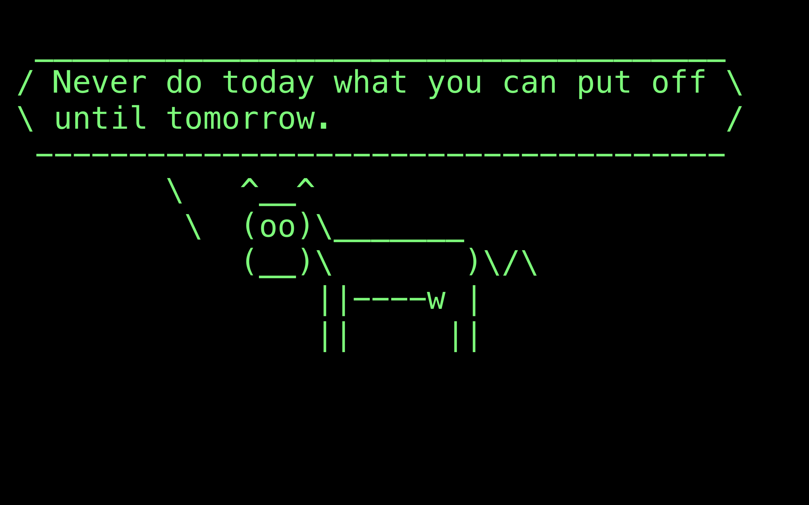
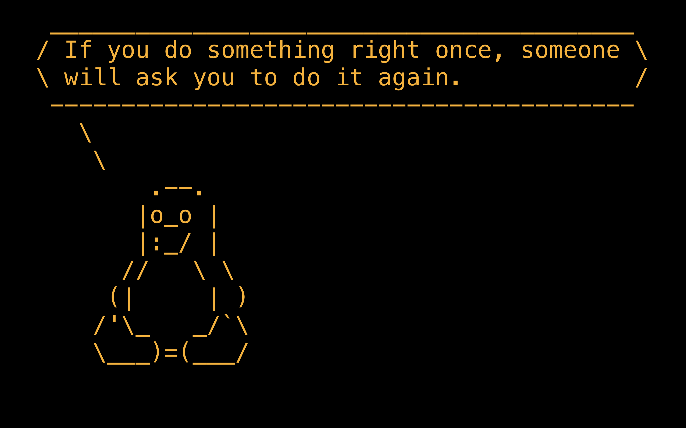
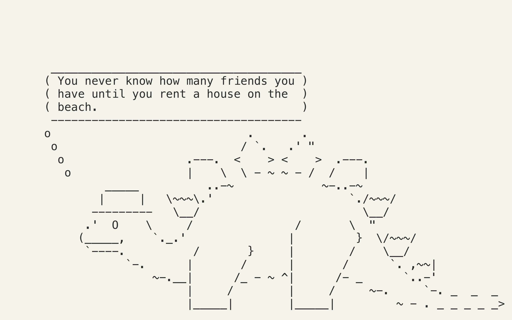

# Cowsaver

**A `fortune | cowsay` screensaver for macOS. Native Swift, zero dependencies, low idle activity.**

Created and maintained by [C. Matthew Sundling](https://github.com/matthewsundling).

*The cows and fortunes are other people’s work. This project is a renderer and screensaver shell.* See [credits.md](credits.md).

```text
 _______________________________________
/ Duct tape is like the force. It has a \
| light side, and a dark side, and it   |
| holds the universe together ...       |
|                                       |
\ -- Carl Zwanzig                       /
 ---------------------------------------
        \   ^__^
         \  (oo)\_______
            (__)\       )\/\
                ||----w |
                ||     ||
```

## Screenshots







## What it includes

- **Cowsaver.saver** — a native macOS `fortune | cowsay` screensaver, built with Xcode Command Line Tools.
- **3,493 curated fortunes** and 47 static cowsay cowfiles, with upstream material and attribution preserved separately.
- **CowsayKit** — a pure-Swift cowsay-compatible rendering core, tested against committed output from cowsay 3.8.4; no Perl or subprocess is required.
- **Cowsaver.app** — a standalone development and fallback app. It is not a lock-screen screensaver.
- **Low idle activity** — Cowsaver renders when its content rotates rather than running a continuous animation loop.

Built with a macOS 13.0 deployment target. Verified on macOS Sequoia 15.7.5, 15.7.7, 15.7.8, and 15.7.9. macOS 26 Tahoe 26.4.1 was tested on Apple silicon but is not currently supported: the Options sheet does not open and timer-based activation can clip content. See [compatibility notes](docs/compatibility.md).

## Install

Cowsaver is built from source and installed locally; it is not Developer ID signed.

```sh
make install
```

Then open System Settings → Wallpaper → Screen Saver and select Cowsaver. macOS may ask you to approve the unsigned screensaver the first time it runs.

To remove it:

```sh
make uninstall
```

If Cowsaver does not appear or run as expected, start with:

```sh
make doctor
```

It shows the macOS, Command Line Tools, Swift, and build information for the installed saver.

## Configuration

Cowsaver reads its settings from:

```text
~/Library/Containers/com.apple.ScreenSaver.Engine.legacyScreenSaver/Data/Library/Application Support/Cowsaver/config.json
```

Create or edit that file to change the rotation interval, cow selection, appearance, and layout. The Options sheet is a convenience when macOS makes it available; the config file is the supported configuration path.

A complete example:

```json
{
  "rotationSeconds": 45,
  "wrapWidth": 40,
  "cowfiles": ["stegosaurus", "default", "tux", "dragon"],
  "randomCow": true,
  "balloonStyle": "say",
  "face": "default",
  "theme": "green-phosphor",
  "fontName": "Menlo",
  "fontSize": 0,
  "transition": "fade",
  "reposition": true,
  "adaptiveWrap": true,
  "maxFortuneLines": 60
}
```

- **`rotationSeconds`** controls how often Cowsaver chooses a new fortune.
- **`cowfiles`** chooses the cowfiles Cowsaver may use. Set **`randomCow`** to `false` to always use the first name in the list.
- **`balloonStyle`** is either `say` or `think`. Leave **`face`** as `default` unless you want to use an advanced cowsay face mode; it is available only through `config.json`.
- **`fontSize`** uses `0` to fit the text to the screen.
- **`theme`** can be `green-phosphor` (the default), `amber`, `paperwhite`, or `solarized-dark`. To use your own colours, omit `theme` and set **`foreground`** and **`background`** to hex colours.
- **`wrapWidth`** is the narrowest balloon width. With **`adaptiveWrap`** enabled, Cowsaver may use a wider balloon when that makes the text meaningfully easier to read.
- **`maxFortuneLines`** limits the height of a fortune after wrapping; set it to `0` for no limit.
- Set **`transition`** to `none` to disable the fade, and **`reposition`** to `false` to keep the content in one place.

Cowsaver includes 47 of the 51 cowfiles distributed with cowsay 3.8.4. The four omitted cowfiles rely on executable Perl rather than static cow art. Unlike cowsay’s configurable `COWPATH`, Cowsaver uses this bundled set. The 47 bundled cowfile names:

```text
actually            alpaca              beavis.zen          blowfish
bong                bud-frogs           bunny               cheese
cower               cupcake             daemon              default
dragon              dragon-and-cow      elephant            elephant-in-snake
eyes                flaming-sheep       fox                 ghostbusters
head-in             hellokitty          kiss                kitty
koala               kosh                llama               luke-koala
mech-and-cow        meow                milk                moofasa
moose               mutilated           ren                 sheep
skeleton            stegosaurus         stimpy              supermilker
surgery             turkey              turtle              tux
vader               vader-koala         www
```

The config file overrides settings saved by the Options sheet. Invalid values fall back to their defaults without preventing the screensaver from running.

## The standalone app

Cowsaver also builds as a standalone app for development, testing, and manual fullscreen use.

```sh
make app
./build/Cowsaver.app/Contents/MacOS/Cowsaver --window
./build/Cowsaver.app/Contents/MacOS/Cowsaver --fullscreen
./build/Cowsaver.app/Contents/MacOS/Cowsaver --idle 300
```

`--idle 300` waits for five minutes of idleness before showing Cowsaver. It checks idle state every five seconds and normally avoids activation while macOS reports a display-sleep assertion, such as while a film is playing.

**The standalone app is not a screensaver.** It does not integrate with screen lock and does not appear on the lock screen. The `.saver` remains the installed screensaver; the app is a useful fallback for manual fullscreen display or development.

## Why

Cowsaver began on a 2019 16-inch MacBook Pro, where continuously rendered screensavers could wake the discrete Radeon GPU and make an otherwise idle machine noisy. A screensaver does not need sixty updates per second to show a fortune and an ASCII cow.

Cowsaver updates its content on rotation rather than running an application-owned continuous render loop. At the default setting, it chooses and draws a new fortune every 45 seconds.

- **No application render loop.** The saver does not override `animateOneFrame()`; its content changes use one shared rotation schedule. `ScreenSaverView` retains its own infrequent default callback.
- **No GPU frameworks.** It uses AppKit text layers and imports none of Metal, SceneKit, SpriteKit, WebKit, GLKit, or OpenGL. `make check` enforces that rule.
- **No external cowsay process.** The cowsay rendering logic is implemented in Swift and tested against cowsay 3.8.4 output.

This is a low-activity design, not a claim about a universal power-saving number. See [power notes](docs/power.md) for the measurement context and limitations.

## Cowsay compatibility

Cowsaver is tested for byte-for-byte compatibility with cowsay 3.8.4 across 219 committed cases.

The test suite compares committed output from real cowsay with Cowsaver output as raw data, including trailing whitespace. The cases cover every bundled cowfile in speech and thought modes, plus representative message shapes, wrap widths, face modes, option interactions, and the no-wrap path.

A few cowsay details are easy to miss:

- `-W 40` wraps at 39 columns because Perl’s `Text::Wrap` reserves the final column.
- `-t` selects tired eyes; it does not create a thought balloon. Thought balloons are the separate `cowthink` mode.
- cowsay measures bytes rather than characters. Cowsaver preserves that behavior, including its handling of non-ASCII input at a wrap boundary.
- Whitespace within a paragraph collapses to a single space unless the no-wrap path is used.

## Content and licensing

Cowsaver displays 3,493 curated fortunes from `fortune-mod` 9708 and 47 static cowfiles from cowsay 3.8.4. It does not execute Perl embedded in cowfiles, so the four cowsay templates that require it are not included.

| Content | What it means | Licence |
|---|---|---|
| Curated fortunes | 3,493 records used at runtime | BSD terms recorded with fortune-mod |
| Static cowfiles | 47 bundled cowsay templates | GPLv3 |
| Preserved source import | 35 files, 13,387 separator entries, 13,353 non-empty records; repository provenance only | BSD terms recorded with fortune-mod |

Cowsaver's own code is GPLv3. The bundled cow art and fortune material retain their upstream terms; Cowsaver does not relicense either. The built products carry their notices inside `Contents/Resources/`.

fortune-mod cautions that quote attributions and exact wording cannot be independently verified. A displayed attribution is therefore not evidence that the named person said the words. If a quotation is misattributed, misquoted, or you hold rights to it and want it removed, open an issue; Cowsaver will remove it from the curated runtime corpus.

See [credits.md](credits.md), [curated fortune provenance](Resources/fortune-curated/provenance.md), and [source-import provenance](Resources/fortune-upstream/provenance.md) for the exact scope, notices, and removal process.

### Your own collection

The bundled curated collection remains the default. You can also import fortune files already installed on your Mac.

```sh
./scripts/import-fortunes.sh --dry-run
./scripts/import-fortunes.sh
```

The script copies fortune files to `fortune-user/` inside Cowsaver’s application-support directory. Imported fortunes are added to the bundled curated collection; they do not replace it. Use `--dry-run` first to see what it would import. Stop and start the screensaver after an import so it creates a new content engine.

Personal fortune files are UTF-8 plain-text files with no filename extension. Separate records with a line containing only `%`; `.dat` and `.u8` index files are ignored. Files whose names end in `-o`, or which are inside an `off/` directory, are skipped under fortune-mod’s legacy convention for separately distributed content. Cowsaver does not curate or classify personal imports: apart from technical display filters, they are used as supplied.

## Building

Cowsaver builds with Xcode Command Line Tools; it does not require the full Xcode app or an `.xcodeproj` to build and install the saver.

`make test` requires a Swift toolchain that includes Swift Testing. On a fresh macOS 26.4.1 installation, Command Line Tools 26.6 did not provide it; see [issue #4](https://github.com/matthewsundling/cowsaver/issues/4).

```sh
make check
make test
make
make cli
```

To compare the command-line renderer with a local cowsay installation:

```sh
echo "hello" | .build/debug/cowsaver-cli -f stegosaurus
diff <(echo hi | .build/debug/cowsaver-cli -f dragon) <(echo hi | cowsay -f dragon)
```

Regenerating the committed golden output requires cowsay 3.8.4 (`brew install cowsay`). Run `make golden` only after intentionally changing cowsay compatibility behavior or updating the pinned cowsay version.

## Documentation

| Document                                                     | Description                                                  |
| ------------------------------------------------------------ | ------------------------------------------------------------ |
| [Architecture](docs/architecture.md)                         | Module layout and the boundary between the reusable core and macOS front ends. |
| [Power notes](docs/power.md)                                 | The low-activity design, measurement context, and limitations. |
| [Compatibility](docs/compatibility.md)                       | macOS versions tested so far and known platform behavior.    |
| [Platform risks](docs/platform-risk.md)                      | The Apple APIs Cowsaver relies on and its fallback paths.    |
| [Credits](credits.md)                                        | Attribution and licensing for the code, cowfiles, and fortune material. |
| [Contributing](CONTRIBUTING.md)                              | Development rules and contribution guidance.                 |
| [Curated fortune provenance](Resources/fortune-curated/provenance.md) | Runtime corpus, curation record, licence, and removals. |
| [Source-import provenance](Resources/fortune-upstream/provenance.md) | Source, licence, and checksum information for the preserved fortune-mod import. |

## License

Cowsaver's code and project-authored documentation are licensed under [GPLv3](LICENSE). The bundled cowfiles and fortune material retain their own terms. See [license-notice.md](license-notice.md) and [credits.md](credits.md).
